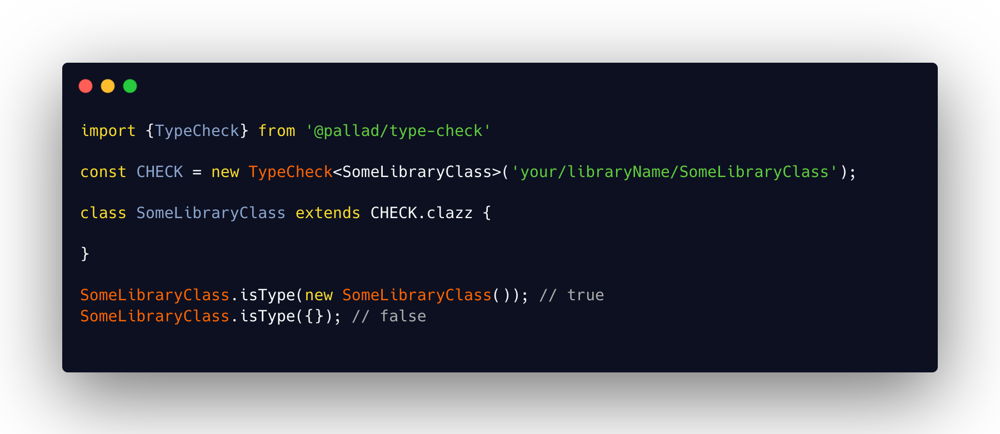

<div align="center">
<h1>Type-check 🔍</h1>

<p>Type checking for libraries creators</p>
</div>

---
[](https://circleci.com/gh/pallad-ts/type-check/tree/master)
[](https://badge.fury.io/js/@pallad%2Ftype-check)
[](https://coveralls.io/github/pallad-ts/type-check?branch=master)
[](https://opensource.org/licenses/MIT)
---



**Problem**

Sometimes `instanceof` might not be enough when working on a library that may potentially be installed multiple times in
a project. More on that [on my blog](https://wookieb.pl/is-instanceof-bad/).

**Solution**

As described [on my blog](https://wookieb.pl/is-instanceof-bad/) - using special `@type` property to indicate final type
of an object.

`@pallad/type-check` is a tool that helps to achieve it in easy way.

# Community

Join our [discord server](https://discord.gg/VHNaw5WRsJ)

# Installation

```shell
npm install @pallad/type-check
```

# Usage

Usage with `TypeCheck` instance in private scope.

```typescript

import {TypeCheck} from '@pallad/type-check';

// Create TypeCheck instance with globally unique identifier for class

const CHECK = new TypeCheck<SomeLibraryClass>('some-library-class-unique-identifier')

export class SomeLibraryClass {
	constructor() {
		// assign necessary properties to current instance
		CHECK.assign(this);
	}

	static isType = CHECK.isType
}


SomeLibraryClass.isType(new SomeLibraryClass()); // true
```

Usage with `TypeCheck.clazz`.

```typescript
import {TypeCheck} from '@pallad/type-check';

const CHECK = new TypeCheck<SomeLibraryClass>('some-library-class-unique-identifier')

export class SomeLibraryClass extends CHECK.clazz {
	// properties assignment are done in constructor automatically
	// static `isType` method is also assigned
}

SomeLibraryClass.isType(new SomeLibraryClass()); // true
```

## About type identifiers

Type identifiers (provided in `TypeCheck's` constructor) must be globally unique so there is no potential conflict with
other type check from other libraries. Therefore recommended pattern fo identifier is: `[packageName]/[className]`
For example:

* `@pallad/type-check/SomeClassName`
* `@pallad/secret/Secret`

## Typescript

Obviously everything is properly typed and proper type guards are applied

```typescript
const CHECK = new TypeCheck<Foo>('foo')

export class Foo extends CHECK.clazz {
	prineMe() {
		return 'hello';
	}
}

if (Foo.isType(value)) {
	// at this stage Typescript knows that `value` is a type of `Foo`
	value.printMe();
}
```
